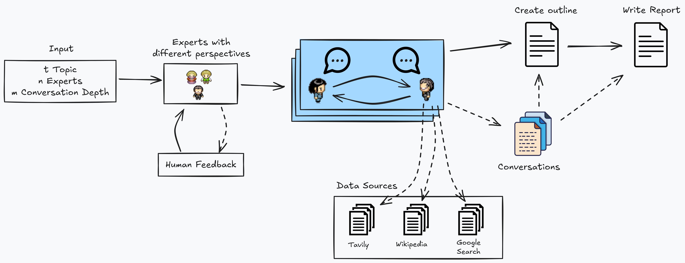

<div align="center">
  <a href="https://github.com/othneildrew/Best-README-Template">
    
  </a>

  <h3 align="center">AI Research and Report Generator</h3>

  <p align="center">
    A research assistant and report generator based on the 
    <a href="https://arxiv.org/abs/2402.14207">STORM</a>
    paper, with an agentic workflow for the synthesis of information through retrieval and multi-perspective question asking.
  </p>
Demo Video:


</div>


<!-- TABLE OF CONTENTS -->
<details>
  <summary>Table of Contents</summary>
  <ol>
    <li>
      <a href="#about-the-project">About The Project</a>
      <ul>
        <li><a href="#key-features">Key Features</a></li>
        <li><a href="#objectives">Objectives</a></li>
        <li><a href="#high-level-architecture">High Level Architecture</a></li>
        <li><a href="#built-with">Built With</a></li>
      </ul>
    </li>
    <li>
      <a href="#getting-started">Getting Started</a>
    </li>
    <li><a href="#usage">Usage</a></li>
    <li><a href="#known-issues">Known Issues</a></li>
    <li><a href="#roadmap">Roadmap</a></li>
  </ol>
</details>

<!-- ABOUT THE PROJECT -->
## About The Project

The AI Research and Report Generator automates reference gathering, content analysis, and report creation using LLMs for each step of the process. It follows the STORM approach to systematically retrieve information and produce coherent insights through iterative question-asking.
It works by
1. Discovering diverse perspectives based on the given topic
2. Simulating conversations between analysts and experts, where the analyst carries a unique perspective and the expert is grounded on trusted internet sources
3. Curating the collected conversations to create an outline and a first draft for a professional report


### Key Features
- Agentic workflow for structured Q&A and report generation
- Multi-source data retrieval for comprehensive coverage
- User friendly UI with visual feedback of the agentic workflow


### Objectives
- Act as a pre-writing stage for a blog post or a research report
- Accelerate research processes with minimal human oversight
- Offer a base structure to easily configure the workflow and accommodate various use cases

### High Level Architecture

<p align="center">
  
</p>

The architecture of the AI Research and Report Generator have three key modules:

1. **Diverse Perspective Generation** \
  Given an input topic *t*, the agentic model identifies diverse perspectives and generates a list of *n* analysts, each with a name, role, affiliation, and description. These perspectives guide the question-asking process. A human feedback node iteratively refines these perspectives until no further feedback is provided.

2. **Conversation Simulation**\
  The system simulates conversations between analyst agents and expert agents on the topic. In each round of the conversation, the LLM-powered analyst generates a question based on the topic, its assigned perspective, and the conversation history. Subsequently, an LLM-powered expert responds with an answer derived solely from retrieved information from the internet.

3. **Report Writing**
  The system curates the simulated conversations to create an outline for the report before the actual writing starts. This let the report writing LLM to take a structured approach of writing the full report, given the topic, the conversations and the references obtained on the whole process
  


### Built With
[![LangChain][LangChain]][LangChain-url] [![LangGraph][LangGraph]][LangGraph-url] [![OpenAI][OpenAI]][OpenAI-url] [![Next][Next.js]][Next-url]


## Getting Started

### Code Structure

.
├── ai                      # AI workflow files
│   ├── core                # Modules used for the graph
│   ├── .env                # Environment variables file
│   └── docker-compose.yaml # To deploy the graph
└── ...                     # NextJs files

### Env variables

You need API keys for three different services: OpenAI, Tavily, and Langsmith. The Langsmith API key is optional but recommended for enhanced logging and observability.

Refer to the following links to learn how to create the keys:
- [OpenAI Quickstart](https://platform.openai.com/docs/quickstart)
- [Tavily Home](https://app.tavily.com/home)
- [Langsmith Documentation](https://docs.smith.langchain.com/)

Add these API keys to the `.env` file inside the `ai` directory. Copy the `.env.example` to create a `.env` file and add the OpenAI, Tavily, and Langsmith keys.

### Installing AI module

You need Docker and the langgraph cli. You can refer to the following links to learn how to install them:

- [Docker Install Docs](https://docs.docker.com/engine/install/)

- [Langgraph CLI](https://langchain-ai.github.io/langgraph/concepts/langgraph_cli/)

To deploy the AI module using Docker containers, execute the following commands:

```bash
# Move to the ai directory
cd ai
# Build the langgraph workflow image
langgraph build -t researcher-v1
# Use docker compose to run the containers
docker compose up
```


### Installing the Webapp

On the root of the project, install the npm packages
```bash
npm install
# or
yarn
```

Then, run the development server:

```bash
npm run dev
# or
yarn dev
```

Open [http://localhost:3000](http://localhost:3000) with your browser to see the webapp.

You can start editing the page by modifying `app/page.tsx`. The page auto-updates as you edit the file.


## Roadmap

- [ ] Integrate local LLMs to minimize costs
- [ ] Implement a reasoning model (Deepseek) to enhance perspective and outline generation
- [ ] Incorporate additional data sources such as Jina Search or SerpAPI
- [ ] Enhance the workflow by assigning a dedicated agent to each section of the report, ensuring a more focused and efficient task execution.
- [ ] Store conversations and references from the interview process in VectorDBs to improve the precision of section writing and reduce costs.


<!-- MARKDOWN LINKS & IMAGES -->
<!-- https://www.markdownguide.org/basic-syntax/#reference-style-links -->
[Next.js]: https://img.shields.io/badge/next.js-000000?style=for-the-badge&logo=nextdotjs&logoColor=white
[Next-url]: https://nextjs.org/
[LangChain]: https://img.shields.io/badge/langchain-1C3C3C?style=for-the-badge&logo=langchain&logoColor=white
[LangChain-url]: https://www.langchain.com/
[LangGraph]: https://img.shields.io/badge/langgraph-1C3C3C?style=for-the-badge&logo=langgraph&logoColor=white
[LangGraph-url]: https://www.langchain.com/
[OpenAI]: https://img.shields.io/badge/openai-412991?style=for-the-badge&logo=openai&logoColor=white
[OpenAI-url]: https://platform.openai.com/
